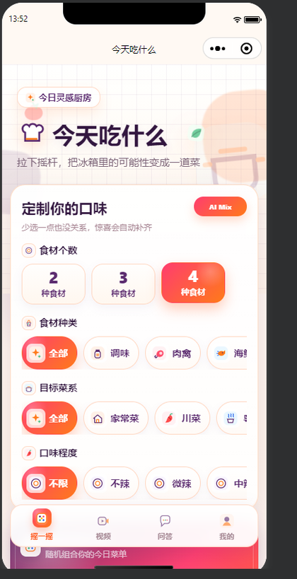
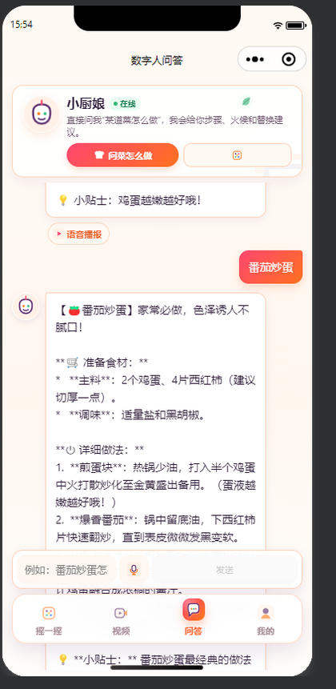
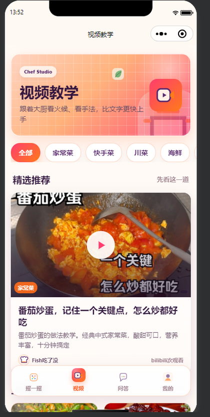
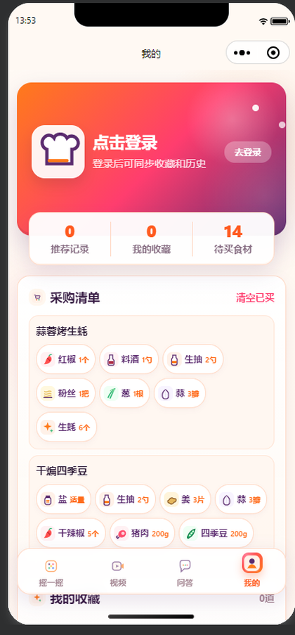

# 今天吃什么 / WhatToCook

> MVP 加固、部署与发布进度见 [开发路线](docs/DEVELOPMENT_ROADMAP.md)、[部署说明](docs/DEPLOYMENT.md) 和 [发布检查表](docs/RELEASE_CHECKLIST.md)。

<p align="center">
  
</p>

<p align="center">
  一款把随机选菜、分步烹饪、教学视频和 AI 厨房问答组合在一起的微信小程序。
</p>

<p align="center">
  <strong>100 道菜</strong> · <strong>160 种食材</strong> · <strong>流式 AI 问答</strong> · <strong>语音播报</strong> · <strong>用户收藏与采购清单</strong>
</p>

## 界面预览

<table>
  <tr>
    <td align="center"><br />摇一摇选菜</td>
    <td align="center"><br />AI 数字人问答</td>
    <td align="center"><br />视频教学</td>
    <td align="center"><br />个人中心</td>
  </tr>
</table>

## 核心能力

| 模块 | 当前能力 |
| --- | --- |
| 智能选菜 | 按食材数量、类型、菜系和口味筛选，摇杆动画结束后匹配菜品 |
| 菜品与步骤 | 食材用量、替换建议、采购清单、分步指导、计时器与进度记录 |
| 视频教学 | 一菜多视频，支持小程序内 MP4/HLS 播放和第三方视频外链 |
| AI 问答 | Ollama `qwen3.5:0.8b`、NDJSON 流式输出、停止生成、重试与 TTS |
| 用户系统 | 账号注册登录、微信登录接口、资料、头像、收藏、历史与采购清单 |
| 管理能力 | 独立 Vue 管理台，支持运营概览、用户与角色、菜品、教学视频和审计日志管理 |
| 离线降级 | 菜品和 AI 服务不可用时可切换本地 Mock，保证核心演示流程可用 |

## 技术架构

```text
微信小程序（WXML / WXSS / JavaScript）
        |
        | HTTPS / JSON / NDJSON streaming
        v
FastAPI + SQLite + JWT
        |
        +-- Ollama：本地大模型
        +-- edge-tts：语音合成
        +-- 微信 code2session：正式微信登录
```

- 小程序：原生组件、自定义 TabBar、`wx.request`、流式分块响应、本地存储。
- 后端：Python 3.10+、FastAPI、Pydantic、PyJWT、bcrypt、httpx、edge-tts。
- 数据：100 道菜、160 种食材、100 条教学视频、10 张 SQLite 表。
- 深入文档：[PROJECT_DOCUMENTATION.md](PROJECT_DOCUMENTATION.md) 包含完整流程、数据结构与 API 清单。
- 本地启动后可访问 Swagger：`http://127.0.0.1:8002/docs`。

## 快速开始

### 1. 准备环境

- 微信开发者工具 Stable
- Python 3.10+
- Ollama，可选；未启动时 AI 会降级到本地回复

### 2. 启动后端

```powershell
Copy-Item .env.example .env
cd backend
python -m venv .venv
.\.venv\Scripts\Activate.ps1
pip install -r requirements.txt
python migrate.py
uvicorn main:app --reload --host 127.0.0.1 --port 8002
```

健康检查：

```powershell
Invoke-RestMethod http://127.0.0.1:8002/api/health/ready
```

### 3. 启动管理后台

```powershell
cd admin-web
npm install
npm run dev
```

管理后台固定使用 `http://127.0.0.1:5175/`，本地 API 默认为 `http://127.0.0.1:8002/api`。后端的 `CORS_ORIGINS` 必须包含管理后台的完整来源（协议、主机和端口）。

本地管理员账号为 `admin`，当前开发密码为 `admin123`。该密码仅用于本地调试，生产环境必须设置强密码并及时更换。

### 4. 启动 Ollama（可选）

```powershell
ollama pull qwen3.5:0.8b
ollama serve
```

### 5. 运行小程序

1. 在微信开发者工具中导入仓库根目录，不要只导入 `miniprogram/`。
2. 确认 `project.config.json` 的 `miniprogramRoot` 为 `miniprogram/`。
3. 本地开发可在“详情 > 本地设置”中关闭合法域名校验。
4. 在 `miniprogram/config/env.js` 选择 `development`、`test` 或 `production` 配置。
5. 编译运行。真机调试必须使用 HTTPS API，并在小程序后台登记合法域名。

## 配置说明

### 后端环境变量

项目统一使用仓库根目录的 `.env`。从根目录 `.env.example` 复制后修改，后端、管理后台和 Docker Compose 会读取同一份配置；生产环境应由部署平台注入变量。

```powershell
Copy-Item .env.example .env
```

| 变量 | 默认/要求 | 说明 |
| --- | --- | --- |
| `APP_ENV` | `development` | `development`、`test` 或 `production` |
| `ADMIN_HOST` / `ADMIN_PORT` | `127.0.0.1` / `5175` | 管理后台开发服务监听地址 |
| `VITE_API_BASE_URL` | `http://127.0.0.1:8002/api` | 管理后台调用的 API 地址 |
| `JWT_SECRET` | 开发环境可省略 | 生产环境必填，建议至少 32 字符随机值 |
| `JWT_EXPIRE_HOURS` | `72` | 登录令牌有效期 |
| `WX_APPID` | 空 | 正式微信登录必填 |
| `WX_SECRET` | 空 | 正式微信登录必填，仅保存在服务端 |
| `OLLAMA_URL` | `http://127.0.0.1:11434/api/chat` | Ollama Chat API |
| `OLLAMA_MODEL` | `qwen3.5:0.8b` | 使用的本地模型 |
| `CORS_ORIGINS` | 本地开发地址 | 逗号分隔的允许来源；生产环境禁止 `*` |
| `ADMIN_USERNAME` | 空 | 首次启动时可选的管理员账号 |
| `ADMIN_PASSWORD` | 空 | 与管理员账号同时配置，至少 10 位 |

### 小程序环境

`miniprogram/config/env.js` 统一维护：

- `API_BASE_URL`：FastAPI 的 `/api` 地址。
- `USE_API`：是否请求后端；关闭时使用 Mock。
- `REQUEST_TIMEOUT`：普通请求超时。
- `STREAM_TIMEOUT`：AI 流式请求超时。

仓库默认使用 `development`。发布前必须把生产 API 改为真实 HTTPS 域名。

### WechatSI 语音识别

代码已包含 WechatSI 调用和不可用降级，但当前 `app.json` 尚未配置正式插件版本。拥有可用插件权限后，再按微信公众平台提供的 AppID 与版本加入 `plugins.WechatSI`；未配置时麦克风入口会提示改用文字输入。

## 验证

```powershell
# 小程序 JavaScript 语法
Get-ChildItem miniprogram -Recurse -Filter *.js | ForEach-Object { node --check $_.FullName }

# 后端编译与测试
python -m compileall -q backend
python -m pytest backend/tests -q

# Git 空白与冲突检查
git diff --check
```

重点手工场景：

- 长食材名和长 AI 回复完整换行。
- 键盘弹出后输入框、底部导航和安全区不重叠。
- AI 流式开始、停止、重试和降级状态清晰。
- 普通用户无法访问管理接口，管理员敏感操作需要确认并留下审计记录。

## 已知限制

- 本地 `localhost` 只适用于开发者工具，真机无法把电脑的 `localhost` 当作后端。
- B 站等第三方 `web-view` 的倍速、快进和全屏能力由第三方页面控制，小程序无法注入或改写播放器。项目仅提供“打开视频”和“复制链接”。
- 微信登录缺少 `WX_APPID` / `WX_SECRET` 时仅允许开发环境使用临时 openid；生产环境会拒绝此降级。
- WechatSI 未配置时语音识别不可用，文字问答和 TTS 不受影响。
- SQLite 适合本地和小规模部署；多实例生产环境建议迁移到 PostgreSQL 或云数据库。

## 优化路线

### P0：上线可靠性

- [x] 集中前端环境配置并补齐后端依赖说明
- [x] 生产环境密钥、CORS 和微信登录配置校验
- [x] 取消首位用户自动成为管理员和固定默认密码重置
- [x] 增加基础 API、鉴权和流式协议测试
- [ ] 配置真实 AppID、HTTPS 域名与发布环境密钥

### P1：体验与视觉

- [x] 新品牌 Logo、问答输入区、安全区、资料头像和长食材名优化
- [ ] 完成全部页面的统一图标、间距、字体、状态与真实菜品图片替换
- [ ] 完善用户饮食偏好、采购清单同步、多计时器和会话管理

### P2：运营管理

- [x] 完成 `admin-web/` 独立管理台基础页面与统一视觉
- [x] 补齐菜品、食材、步骤、视频、用户和审计日志基础管理
- [ ] 补齐 AI 配置页面、细粒度角色权限和审计导出
- [ ] 将生产数据库迁移到 PostgreSQL 或微信云开发数据库

## License

MIT License。当前仓库用于学习、课程项目和个人开发；第三方视频及平台品牌归各自权利方所有。
